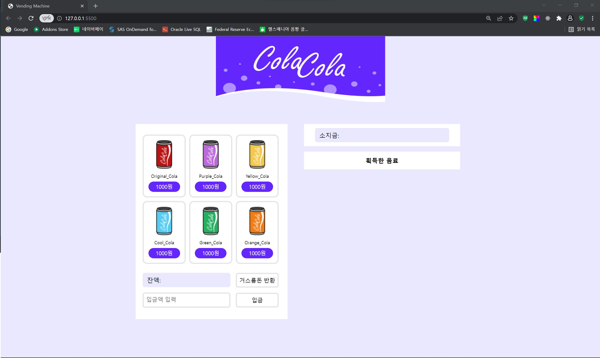
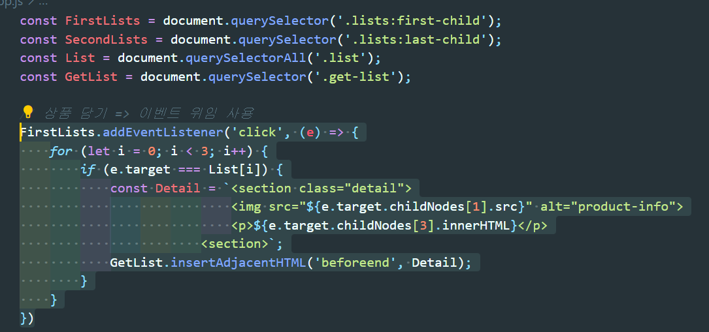
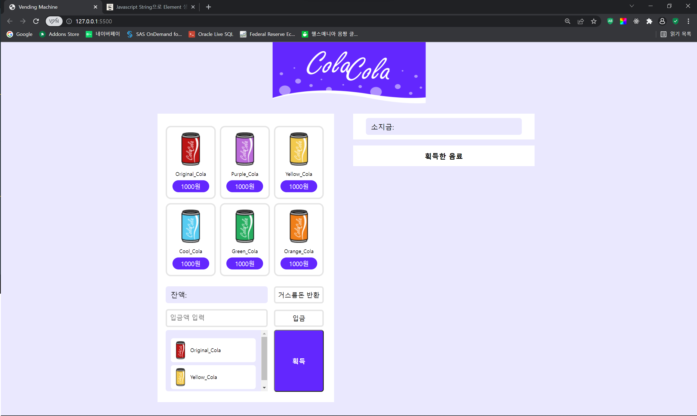
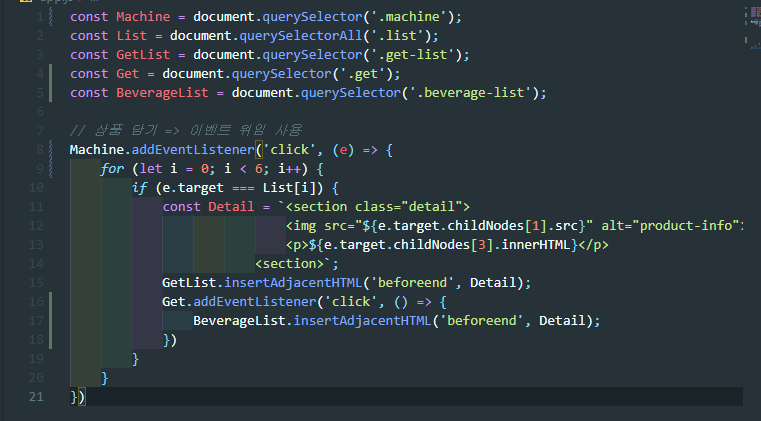
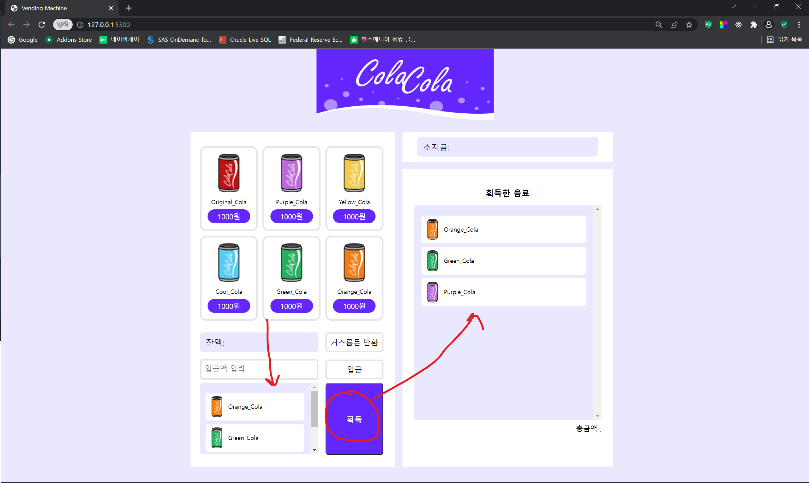
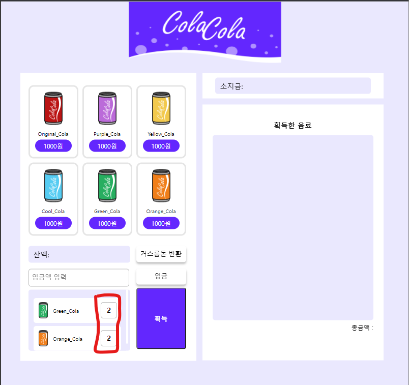

# 음료 자판기 만들기

- ## 주소

  https://yoojs1205.github.io/vending_machine/

- ## 사용한 기술 스택

  </a>&nbsp;
  </a>&nbsp;
  </a>&nbsp;

  <br><br>

- ## 개발일지

  - 0409 (토)

    1. 전체적인 퍼블리싱
       - 헤더 => 로고 삽입
       - 왼쪽 음료 자판기 퍼블리싱
       - 오른쪽 구매한 음료 목록 퍼블리싱 (진행중)
       <br><br>
       <div align="center">
         
       </div><br>

  - 0410 (일)

    1. 퍼블리싱
       - 왼쪽 음료 자판기 선택한 음료 리스트창 추가
       - 왼쪽 음료 자판기 획득 버튼 추가
    2. 상품 담기 기능 구현
       - 부모 요소에 이벤트리스너를 걸어 이벤트위임 사용
       - 이벤트 타깃의 속성으로 클릭한 요소의 이미지, 텍스트에 접근

    <br>
    <div align="center">
      
    </div>

    <br><br>
    <div align="center">
      
    </div><br>

  - 0412 (월)

    1. 상품 담기 기능 수정
       - 6개 음료수를 담는 부모 요소에 이벤트리스너를 걸어서 이벤트 위임하는 방식으로 변경
    2. 장바구니에 담은 상품 획득한 음료로 담는 기능 구현
       - 획득 버튼을 누르면 획득한 음료 창으로 넘는 기능 구현
       - 음료 품목에 걸은 이벤트리스너 내부에 획득 버튼에 대한 이벤트리스너 부여
       <div align="center">
       
       </div><br>
       <div align="center">
       
       </div><br>
    3. 자판기 중앙정렬 해결
       - position: absolute, transform 사용
       ```css
       .wrapper {
         position: absolute;
         left: 50%;
         top: 50%;
         transform: translate(-50%, -50%);
         height: 100%;
       }
       ```

  - 0415 (금)

    1. 스크롤바, 장바구니에 담은 음료수의 갯수 퍼블리싱
       <div align="center">
        
       </div><br>

  - 0416 (토)
    1. 같은 제품을 클릭했을 때 갯수가 늘어나는 기능 구현<br>
       - 6개 제품이 클릭된 횟수를 저장한 배열을 선언
       - 제품을 눌렀을 때 생기는 요소에 해당 제품의 이름을 클래스로 부여
       - 해당 제품이 2번째 클릭됐을 때부터는 새로운 상품으로 뜨지 않고 숫자만 늘어나는 기능을 조건문으로 구현
       ```javascript
       // 각각 1~6번 제품이 클릭된 횟수를 0으로 초기화
       var clickNumArray = [0, 0, 0, 0, 0, 0];
       // 제품 클릭 이벤트리스너 (이벤트 위임)
       Machine.addEventListener("click", (e) => {
         for (let i = 0; i < 6; i++) {
           // 제품이 클릭되면, 해당 index의 클릭횟수가 1 증가
           if (e.target == List[i]) {
             clickNumArray[i]++;
             // 첫 번째 클릭이면 html 요소 생성, 2번째 부터는 숫자만 증가
             // 해당 제품 이름의 클래스를 부여
             if (clickNumArray[i] == 1) {
               var Detail = `<section class="detail">
                           
                           <p class="beverage-name">${e.target.childNodes[3].innerHTML}</p>
                           <p class="beverage-num ${e.target.childNodes[3].innerHTML}">${clickNumArray[i]}</p>
                       <section>`;
               GetList.insertAdjacentHTML("beforeend", Detail);
             } else {
               document.querySelector(
                 `.${e.target.childNodes[3].innerHTML}`
               ).innerHTML = clickNumArray[i];
             }
           }
         }
       });
       ```
